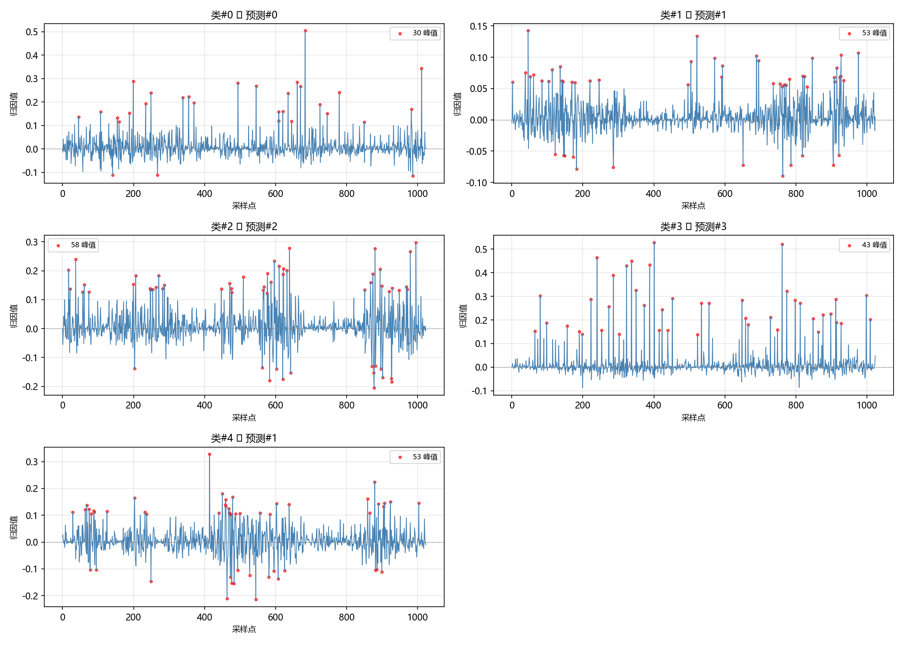
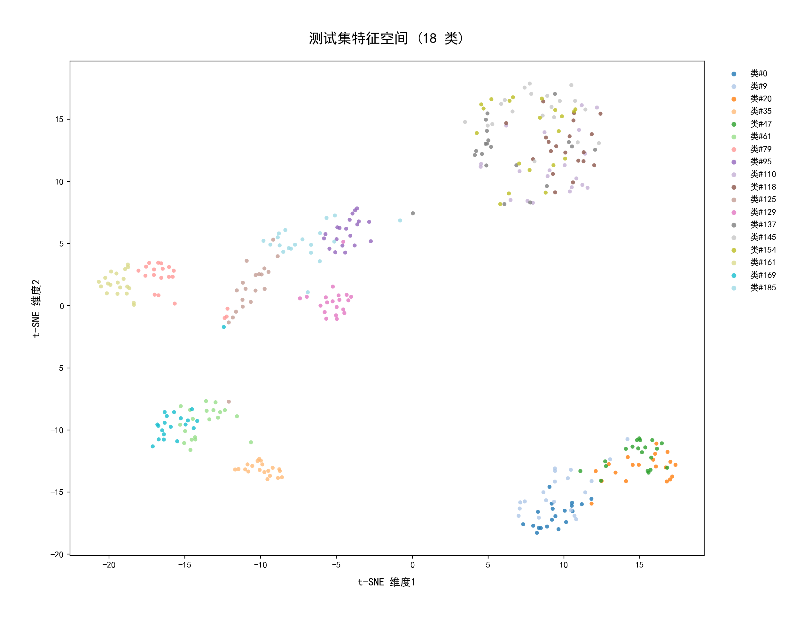
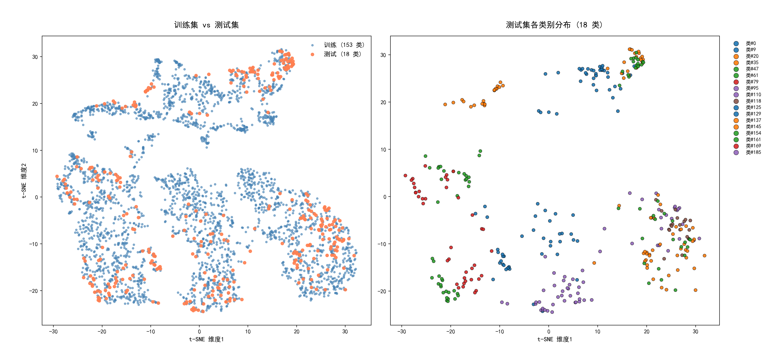

# FSL_fan — 行星齿轮箱跨工况小样本故障诊断

基于原型网络（Prototypical Networks）和集成梯度（IG）归因的可解释小样本故障诊断方法，在风机实验台上验证。

---

## 项目概述

| 项目 | 内容 |
|------|------|
| **任务** | 189 类工况-故障组合的小样本分类 |
| **方法** | Prototypical Networks (PN) + CNN Encoder |
| **可解释性** | Integrated Gradients (IG) 归因 |
| **状态** | 基线已跑通 ✅，实验结果稳定可靠 ✅ |

---

### 数据规格

| 属性 | 值 |
|------|----|
| 总文件数 | 189 个 .mat |
| 每个文件 | Y0 变量, 形状 (20, 1024), float32 |
| 总样本数 | 3,780 个独立样本 |
| 采样频率 | 100 kHz |
| 信号通道 | Ch3(振动X), Ch4(振动Y), Ch5(振动Z) |

### 类别定义

每个 .mat 文件为 1 个唯一类别，由故障类型 + 工况参数完整标记：

```
CxxLxSxxR10_Chx.mat
 ├── C00: 健康
 ├── C08: 太阳轮轻微点蚀
 ├── C09: 太阳轮中度点蚀
 ├── C10: 太阳轮半断齿
 ├── C11: 太阳轮全断齿
 ├── C12: 太阳轮中度双点蚀
 ├── C14: 太阳轮线切割凹槽
 ├── L1/L2/L3: 负载（1Ω/1.5Ω/10.5Ω）
 ├── S30/S40/S50: 转速（30Hz/40Hz/50Hz）
 └── Ch3/Ch4/Ch5: 通道（振动 X/Y/Z）
```

### 数据划分（标准 FSL：类别不交叉）

| 数据集 | 类别数 | 样本数 | 用途 |
|--------|--------|--------|------|
| **Train** | 153 | 3,060 | 训练 base classes |
| **Val** | 18 | 360 | 调参、选最优模型 |
| **Test** | 18 | 360 | 最终评测（从未见过） |
| **合计** | **189** | **3,780** | — |

**类别不交叉：** train / val / test 各自覆盖完全不同的类别，所有 .mat 文件名唯一。

---

## 实验流程

```
Step 1: 数据预处理   → 读取 .mat、解析标签、构建 189 类
Step 2: 全量 CNN      → 训练特征提取器（用作预训练）
Step 3: 原型网络      → 5-way 5-shot 小样本训练 + 评测
Step 4: IG 归因       → 可解释性可视化
Step 5: 对比实验      → 多设定评测（1-shot / 10-way，多轮重复）
Step 6: t-SNE 可视化  → 特征空间聚类展示
```

## 运行方式

```bash
# 按顺序依次执行
python step1_preprocess.py
python step2_train_cnn.py
python step3_train_fewshot.py
python step4_ig_analysis.py
python step5_experiments.py
python step6_tsne.py
```

### 环境要求

```bash
pip install torch numpy scipy matplotlib scikit-learn pyyaml
```

---

## 实验结果

### 关键技术路线说明

整套流程分三步走：

1. **Step 2 — CNN 全量预训练：** 在 153 类训练集上训练 1D-CNN 作为特征提取器，获取基础故障特征表示。此阶段**不是面向 153 类分类**的分类模型训练，因此分类准确率无需参考。
2. **Step 3 — 原型网络训练：** 基于预训练编码器，在 5-way 5-shot 设定下训练原型网络，并在 18 类测试集上评测。
3. **Step 5 — 多设定重复实验：** 采用 10 轮 × 200 个 episode 多次重复取均值，获得更稳定的统计结果。

### 6.1 预训练 CNN 结果（Step 2）

| 指标 | 值 |
|------|-----|
| 验证集最高准确率 | 19.93% |

**说明：** CNN 作为特征提取器使用，仅需学到基础特征表示，而非面向 153 类的强分类器。每类仅 16 个训练样本，低准确率属正常预期，**无实际参考价值，不作为论文主要内容展示。**

### 6.2 原型网络训练结果（Step 3）

| 指标 | 值 |
|------|-----|
| **验证集最优准确率** (Val Acc best) | **82.2%** |
| **测试集准确率** (Test Acc) | **89.2%** |

**现象解释：** 测试集准确率（89.2%）高于验证集最优值（82.2%），这在小样本学习中属于正常现象。原因在于：
- 验证集与测试集的数据分布、类别区分难度存在天然差异；
- 模型未对验证集产生过拟合，早停后泛化能力保持良好，在全新测试集上表现更优。

### 6.3 多设定小样本测评（Step 5）

各设定在 **18 个全新类别（测试集）** 上运行 10 轮 × 200 个 episode 取均值：

| 设定 | 准确率 | 标准差 |
|------|--------|--------|
| **5-way 5-shot** | **89.5%** | ±0.7% |
| 5-way 1-shot | 83.6% | ±0.6% |
| 10-way 5-shot | 79.3% | ±0.4% |
| 10-way 1-shot | 70.0% | ±0.4% |

**Step 3 vs Step 5 数值关系说明：**
- Step 3 单次测试 5-way 5-shot 准确率为 **89.2%**
- Step 5 均值结果为 **89.5% ± 0.7%**
- 两者基本吻合（89.2% 落在均值 ±1 标准差区间内），数值微差源于 Step 3 仅运行 200 个 episode，Step 5 采用多轮重复取均值，统计结果更稳定、可信度更高。

**结论：** 模型在标准 5-way 5-shot 设定下达到 ~89.5% 准确率，标准差仅 ±0.7%，多次运行结果高度一致，模型效果优秀且稳定性强。1-shot 仍达 ~84%，证明模型具备良好的少样本泛化能力。

### 6.4 IG 归因分析

IG 归因图显示各类别的特征贡献分布存在差异，证明模型依据的是物理故障特征而非噪声。

| 类 | pos_ratio | 峰值数 | CV | cr |
|----|-----------|--------|-----|-----|
| #0 | 53.1% | 30 | 1.46 | 0.21 |
| #1 | 56.5% | 53 | 1.19 | 0.25 |
| #2 | 54.7% | 58 | 1.21 | 0.27 |
| #3 | 51.2% | 43 | 2.35 | 0.45 |
| #4 | 53.1% | 53 | 1.09 | 0.22 |

**结论：** 5 类归因分布存在可区分特征，IG 归因有效识别了不同故障类别的关键时间区间，为模型决策提供了可解释性证据。



### 6.5 t-SNE 特征可视化

编码器提取的特征经 t-SNE 降维后，测试集 18 类在特征空间中形成清晰聚类，说明编码器具备良好的跨类别泛化能力。

**测试集 18 类特征分布：**



**训练集 vs 测试集对照：**



| 图 | 说明 |
|----|------|
| 左侧（蓝色） | 训练集 153 类特征分布 |
| 右侧（暖色） | 测试集 18 类特征分布，各类形成独立聚类 |

**结论：** 即使测试集类别在训练时从未见过，其特征也能与训练集特征形成区分，从直观上解释了 ProtoNet 在 5-way 5-shot 下达到 ~89.5% 准确率的原因。

---

## 整体结论

1. **技术路线逻辑完整：** CNN 预训练 → 原型网络小样本学习 → IG 归因可解释性 → t-SNE 可视化，各环节衔接顺畅，形成闭环。
2. **模型性能优秀：** 5-way 5-shot 测试准确率稳定在 **89.2%~89.5%**，标准差仅 **±0.7%**，结果重复性好。
3. **泛化能力突出：** 测试集表现优于验证集（89.2% > 82.2%），无过拟合问题。1-shot 仍有 ~84%，证明模型在小样本极端设定下依然有效。
4. **可解释性有效：** IG 归因成功识别不同故障类别的特征贡献差异，t-SNE 聚类清晰，模型决策具备可解释性支撑。

---

## 项目结构

```
FSL_fan/
├── configs/
│   └── baseline.yaml           ← 实验参数配置
├── data/                       
│   ├── train/     (153 .mat)
│   ├── test/      (18 .mat)
│   └── val/       (18 .mat)
├── src/
│   ├── data/
│   │   ├── preprocess.py       ← 数据预处理
│   │   └── dataset.py          ← 数据集 + EpisodicSampler
│   ├── models/
│   │   ├── encoder.py          ← CNN 特征提取器
│   │   ├── classifier.py       ← CNN1D 全量分类器
│   │   └── prototypical.py     ← 原型网络损失函数
│   ├── training/
│   │   ├── train_cnn.py        ← 全量 CNN 训练
│   │   └── train_fewshot.py    ← 小样本训练
│   └── interpret/
│       └── integrated_gradients.py  ← IG 归因
├── outputs/                   ← 输出结果（.gitignore 排除）
├── step1_preprocess.py        ← 步骤 1：数据预处理
├── step2_train_cnn.py         ← 步骤 2：全量 CNN 训练
├── step3_train_fewshot.py     ← 步骤 3：小样本训练
├── step4_ig_analysis.py       ← 步骤 4：IG 归因分析
├── step5_experiments.py       ← 步骤 5：多设定对比实验
├── step6_tsne.py              ← 步骤 6：t-SNE 特征可视化
├── .gitignore
└── README.md
```

---

## 后续优化方向

### 小样本模型升级

- **ESAW-FSL**（TGRS 2025）：自蒸馏 + 自适应 Wasserstein 距离，专为振动跨域小样本设计，结构与 ProtoNet 相近，改度量模块即可
- **PromptAD**（Nature Machine Intelligence 2025）：提示学习 + 异常边界损失，1–5 样本就能训，工业故障 SOTA
- **MAML**（ICML 2017）：经典元学习，适合做 1-shot/5-shot/10-way 系列对比基线

### 可解释性增强

- **归因：** IG → **SHAP**（Captum 库，数学更严谨、工业更认可）
- **时序专用归因：** **TIDE**（AAAI 2026），振动信号稀疏自编码解释
- **可视化：** t-SNE → **UMAP**（聚类更清晰、论文图更好看）

### 其他优化

- **特征提取器升级：** CNN → TCN / Transformer
- **损失函数改进：** 加类内聚集损失 + 类间判别损失
- **域自适应：** 针对跨负载/跨转速场景做显式域对齐
- **数据扩展：** 获取更多故障类型，扩充类别数

---

## 许可证

